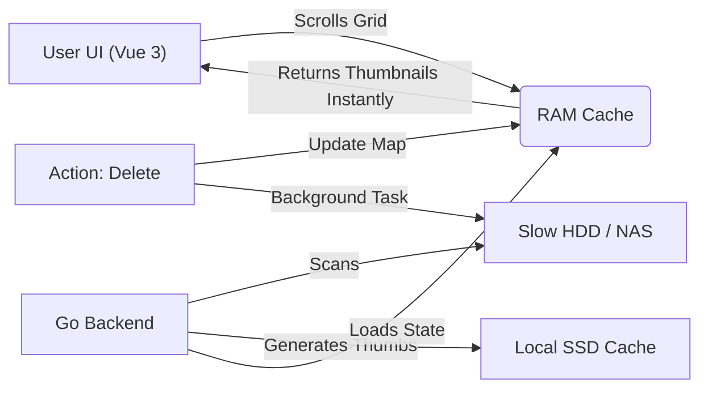

# 📸 [Insert Chosen Name] (e.g., Magpie / Flashpoint)

A high-performance, desktop-based photo management tool designed for curating massive libraries (20,000+ images) stored on slow HDDs or Network Drives.

## 🧠 The Philosophy: "Video Game Architecture"

Unlike traditional apps that query a database (SQL) for every scroll event, this application prioritizes **Interaction Latency** over **Startup Time** and **RAM Usage**.

1.  **In-Memory Truth:** Upon launch, the entire application state (metadata + thumbnails) is loaded into RAM.
    - _Target RAM:_ ~2GB - 4GB.
    - _Target Startup:_ < 30 seconds.
2.  **Zero Latency:** Once open, scrolling, sorting, and searching are instantaneous (0ms latency) because no disk I/O occurs during interaction.
3.  **The "Slow Drive" Strategy:**
    - **Raw Photos:** Live on your slow HDD/NAS.
    - **Thumbnails:** Generated once and cached on your local fast SSD (and loaded into RAM).
    - **Result:** You can browse a NAS folder at 60FPS. We only touch the network drive when you double-click to view the full image.
4.  **Persistence:** State is saved to a compressed binary file (`library.gob`) on exit or manual sync.

## 🛠 Tech Stack

- **Frontend:** Vue 3 (Composition API) + Vite.
- **Backend:** Go (Golang) - Handles the "Heavy Lifting" (Scanning, Hashing, Memory Management).
- **Bridge:** [Wails v2](https://wails.io/) - Compiles Go + Vue into a single native binary.
- **State:** Native Go Maps protected by `sync.RWMutex`.

## 🏗 Architecture Overview



## 🗺️ Implementation Roadmap

### Phase 1: The Skeleton 🚧

- [ ] Install Go and Wails.
- [ ] Initialize project: `wails init -n photo-manager -t vue`
- [ ] Verify "Hello World" (Input text in Vue -\> Printed in Go Console).

### Phase 2: The Data Layer (The Brain) 🧠

- [ ] Create `structs.go`: Define `Photo` and `Library` structs (PascalCase).
- [ ] Implement `LoadLibrary()`: Read `.gob` file from disk into a global RAM Map.
- [ ] Implement `SaveLibrary()`: Write global RAM Map to disk.

### Phase 3: The Scanner (The Eyes) 👀

- [ ] Create `scanner.go`: Recursive walker using `filepath.WalkDir`.
- [ ] **Worker Pool Pattern:** Use a fixed number of Goroutines to scan files (prevents OS file limit errors).
- [ ] "New File" Logic: If file not in RAM Map -\> Add it.
- [ ] "Missing File" Logic: If file in RAM Map but not on Disk -\> Mark as missing.

### Phase 4: The Visuals (The Speed) ⚡

- [ ] Implement Thumbnail Generator: Resize images to 300px JPEGs (using `disintegration/imaging`).
- [ ] **Crucial:** Store thumbnail bytes in the In-Memory Map, _not_ alongside the source file.
- [ ] Connect Wails to Vue: Send thumbnail data as Base64/Blob to the grid.

### Phase 5: The Logic (The Cleaner) 🧹

- [ ] **Duplicate Detection Funnel:**
  1.  Group by File Size (Instant).
  2.  Hash first 4KB (Fast).
  3.  Full Hash (Slow - only for collisions).
- [ ] Implement "Delete/Move" actions in Go.

## 🚀 How to Run (Dev Mode)

```bash
# Run the app in "Live Reload" mode
wails dev
```

## 📝 Coding Standards

- **Go:** Idiomatic Go. Use `camelCase` for private variables and `PascalCase` for exported Wails methods and Structs.
- **Concurrency:** ALWAYS use `sync.RWMutex` when accessing the `Library` map.
- **Vue:** Use `<script setup lang="ts">`. Call Go functions directly from `wailsjs`.
